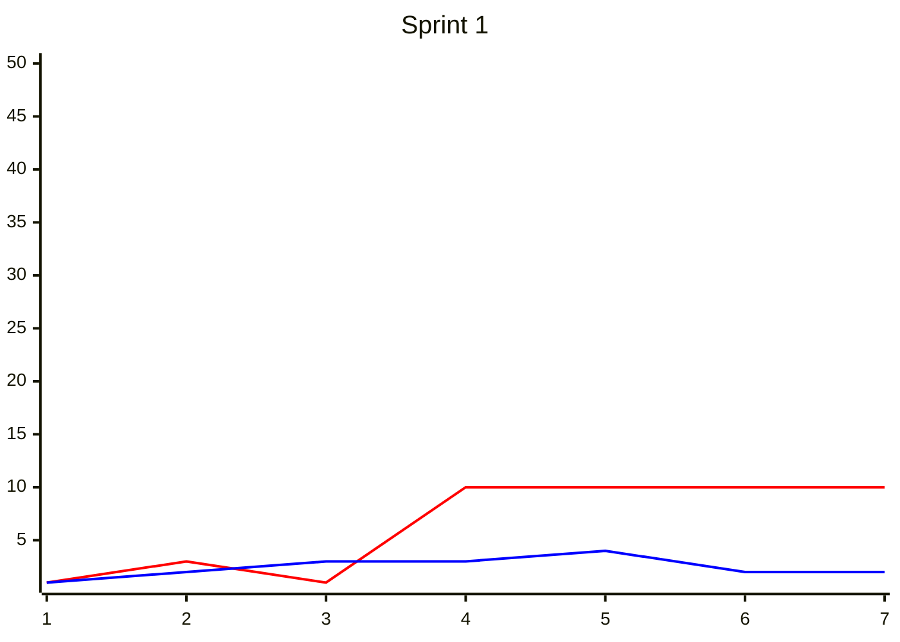

```mermaid
%%{init: {"themeVariables": {"xyChart": {"plotColorPalette": "#ff0000, #0000ff"}}}}%%


xychart-beta
    title "Sprint 1"
    x-axis [1, 2, 3, 4, 5, 6, 7]
    y-axis 1 --> 50
    line "IST" [1, 3, 1, 10, 10, 10, 10]
    line "PLAN" [1, 2, 3, 3, 4, 2, 2]
```

■ IST &nbsp;&nbsp; ■ PLAN
