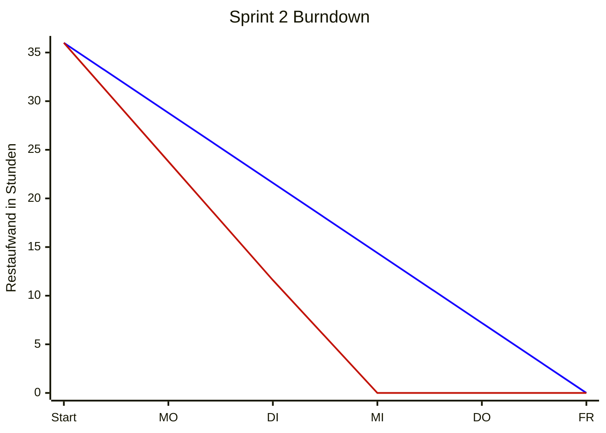

■ IST &nbsp;&nbsp; ■ PLAN

## Kapazität

- Gemeldete verfügbare Stunden: **91 h**
- Eingeplante Issues: **3** mit insgesamt **36 h** geschätztem Aufwand

## Geleistete Stunden (IST)

Berechnung IST-Linie: Restaufwand = 36 h − Gesamt geleistete Stunden (auf 0 begrenzt).

| Person | MO | DI | MI | DO | FR | Summe | 
|---|---|---|---|---|---|---|
| Niklas | 2 | 3 | 3 | 2 | – | 10 | 
| Philipp | – | 3 | 2,5 | 3 | 1,5 | 10 | 
| Sascha | 1,5 | 1,5 | 1,5 | 1,5 | 1,5 | 7,5 | 
| Benni | 1,5 | 1,5 | 1,5 | 1,5 | 1,5 | 7,5 | 
| Radu | 1,6 | 1,6 | 1,6 | 1,6 | 1,6 | 8 | 
| Jesse | 4 | 4 | 4 | 4 | 4 | 20 | 
| **Summe/Tag** | **10,6** | **14,6** | **14,1** | **13,6** | **9,6** | **62,5** | 
| **kumuliert** | **10,6** | **25,2** | **39,3** | **52,9** | **62,5** | |

**Annahmen / offene Punkte:**
- Radus 8 h ohne Tagesangabe → gleichmäßig auf 5 Tage verteilt (1,6 h/Tag).
- Jesse mit 4 h/Tag angesetzt (20 h gesamt).
- Die geleisteten Stunden (~62,5 h) übersteigen den geschätzten Umfang (36 h) deutlich → die IST-Linie erreicht rechnerisch ab MI die 0, tatsächlicher Aufwand lag weit über der Schätzung.
