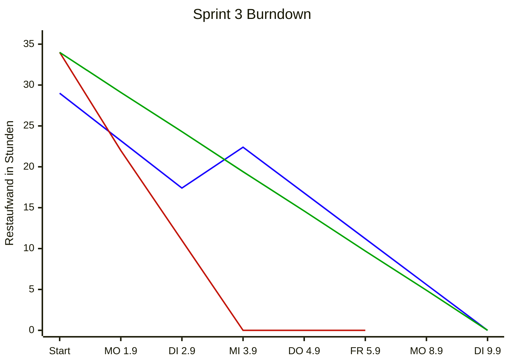

 ■ SOLL &nbsp;&nbsp; ■ IST &nbsp;&nbsp; ■ IDEAL

## Kapazität
Eingeplante Issues: **3** mit insgesamt **34 h** geschätztem Aufwand *(ursprünglich 29 h im Planning Poker)*
- Interaktion 1: 13 h
- Nutzerverwaltung: 8 h
- Umgebung 1: 13 h  *(am 03.09. von 8 h hochgesetzt)*

**Linien:**
- **IDEAL** – gleichmäßige lineare Abnahme von 34 h auf 0 über die 7 Sprinttage (Referenz), ~4,9 h/Tag.
- **SOLL** – geplanter Restaufwand nach Schätzung: bis DI 02.09. der ursprüngliche Planning-Poker-Plan (29 h, 5,8 h/Tag). Am MI 03.09. hebt die Umgebung-1-Erhöhung (+5 h) den Restaufwand von 17,4 h auf 22,4 h; von dort linear auf 0 bis zum verschobenen Sprintende DI 09.09. (5,6 h/Tag).
- **IST** – tatsächlicher Restaufwand (siehe unten).

---

## Geleistete Stunden (IST)
Berechnung IST-Linie: Restaufwand = 34 h − kumulierte geleistete Stunden (auf 0 begrenzt).

| Tag          | MO 1.9 | DI 2.9 | MI 3.9 | DO 4.9 | FR 5.9 | MO 8.9 | DI 9.9 | Summe |
|---           |---     |---     |---     |---     |---     |---     |---     |---    |
| Stunden/Tag  | 12     | 11     | 11     | 12     | 12     | --     | --     | 58    |
| kumuliert    | 12     | 23     | 34     | 46     | 58     | --     | --     |       |
| Restaufwand  | 22     | 11     | 0      | 0      | 0      | --     | --     |       |

## **Annahmen / offene Punkte:**
- Gesamtschätzung **34 h** = Interaktion 1 (13 h) + Nutzerverwaltung (8 h) + Umgebung 1 (13 h, am 03.09. durch Süheyl von 8 h hochgesetzt). Ursprüngliche Planning-Poker-Summe: 29 h (Umgebung noch 8 h).
- IDEAL-Linie linear über **7 Arbeitstage** (MO 01.09. – DI 09.09., Wochenende ausgenommen), ~4,9 h/Tag. Sprintende wurde im Meeting 03.09. von FR 05.09. auf 09.09. verschoben.
- SOLL-Linie startet mit 29 h (Planning Poker), bekommt am 03.09. den Umgebung-1-Aufschlag (+5 h) und läuft von 22,4 h linear auf 0 bis DI 09.09.
- IST wird gegen die aktuelle Schätzung (34 h) gerechnet.
- IST-Werte sind Team-Tagessummen aus der obigen Tabelle.
- DI (02.09.) mit 11 h angesetzt (Meeting_03.09.: Radu 2, Philipp 0,75, Jesse 2, Cicero 1, Sascha 1, Benni ~1, Süheyl 3).
- `DailyScrum_03.09.xlsx` und `DailyScrum_04.09.xlsx` enthalten keine erfassten Zeiten.
- DO/FR sind zum Stand 04.09. noch nicht abgeschlossen → Zahlen vorläufig.
- Die geleisteten Stunden (58 h) übersteigen die Schätzung (34 h) deutlich → IST-Linie erreicht rechnerisch ab MI (03.09.) die 0. Zweite Sprintwoche (MO 08.09. / DI 09.09.) noch ohne Ist-Daten.
